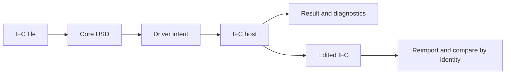

# IFC in, IFC out

## 1 The problem

IFC in, IFC out. Coordinators need to edit a wall or pipe in USD while retaining an editable IFC document and a measurable record of what the host actually solved.

## 2 The data as it arrives

IFC4 and IFC4X3 files carry spatial aggregates, product identities, placements, types, Psets and native geometry. Conversion imports that context; the optional kind pass adds editable wall, pipe and camera drivers. The [converter](converter.md) describes each pass and the deliberate losses.

## 3 The model in USD

Core spatial types form the namespace; elements use AecoElementAPI, classification and one aeco:id. Type occurrences inherit catalog prims. Sync bindings cache native GlobalIds. Intent carries drivers; result and derived layers carry solved drivers, meshes and guides.

## 4 Workflow

1. Convert: `aeco-ifc convert model.ifc -o model.usda`. The module form is `python -m usdaeco_ifc.convert model.ifc -o model.usda`.
2. Create drivers and bindings: `aeco-ifc init model.ifc model.usda --directory session`.
3. Author a sparse intent: `aeco-sync --stage session/stage.usda edit /Element length=3`.
4. Apply: `aeco-sync --stage session/stage.usda apply --host ifc`.
5. Convert the exported IFC again and compare receipts by aeco:id.

The [round-trip runner](../examples/roundtrip/run.py) resolves actual facility paths and executes these steps.

## 5 Validation

| Check | Severity | Detects |
|---|---|---|
| Converter contract | error | lost spatial parents, identity or classification |
| Sync preflight | error | stale intent, derived edits, missing binding, invalid section |
| IFC native validation | native severity | touched-closure schema and geometry findings |
| Convergence | separate driver/body verdicts | missing values, axis, size, height, bounds and volume differences |

Optional full EXPRESS and IDS checks remain explicit; IDS requires ifctester. Native operation tables are owned by the [sync host contract](https://github.com/criad-com/usdaeco-sync/blob/v0.5.5/docs/host-contract.md).

## 6 The example on the demo data centre

The runner composes the published base USD from datacentre v0.4.9 and generates
its matching IFC in scratch space. It edits one wall and one pipe, exports,
reimports, and compares final drivers and bodies with native receipts.
[The committed result](../examples/roundtrip/README.md) contains the final
reimported stage flattened, its own diffable layers, and a stock USD render.
The camera fits both bodies; enclosing room volumes retain guide purpose.
The gate requires at least 2% foreground coverage, unchanged findings, S27
relocation/fresh-result equality and S28 plugin-free rendering. Live rows
remain NOT RUN.

## 7 Trade-offs and alternatives

The converter emits a tessellated review representation. Vendor constraints, editable solids, styles and arbitrary Psets are not reconstructed from meshes. Psets remain quarantined under aeco:props; classification is the kind mechanism. Native import requires reconstruction-grade drivers. A file-format plugin or live resolver could provide another source route while retaining the same authored layers.

The optional [exact pass](exact.md) exports evaluated solids to independent
BrepArray and proxy-twin layers. Its default converter path remains unchanged.

## 8 Out of scope and open questions

The optional `aeco-ifc-exact` pass requires its separate OCCT runtime. Live Blender and Revit integrations own their own runtimes. The current IFC host requires metre length units; the converter also handles millimetres. No universal USD-to-IFC reconstruction is claimed.

## 9 Status

Version 0.2.3, integration kind with no schema directory. S01–S05 and S20–S29 apply; S06–S19 are not applicable. Core is v0.9.5; AecoAxisAPI is supplied by axis v0.1.5. Source metadata allows the entry point to be exercised without installing packages in a shared interpreter. See the acceptance report for observed counts and unresolved packaging or Nix limits.
